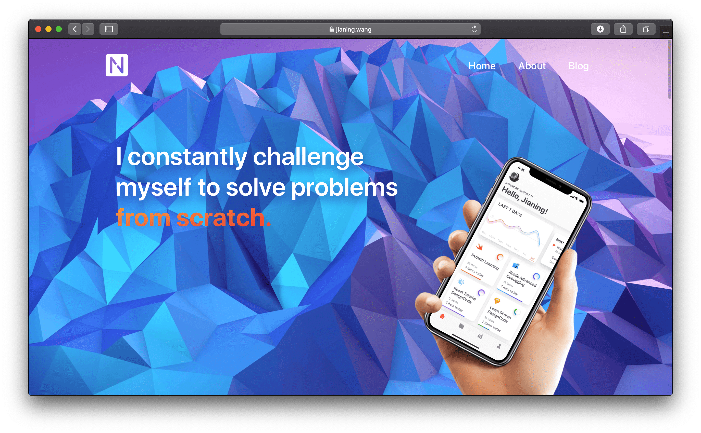

# Jianing's blog

This is [Jianing's blog](https://jianing.wang) powered by [Gatsby](https://www.gatsbyjs.org). Thanks to [DesignCode](https://designcode.io) and [gatsby-starter-blog](https://github.com/gatsbyjs/gatsby-starter-blog). 

## Glance




## Quick start

```sh
# install the Gatsby CLI globally
npm install -g gatsby-cli
git clone https://github.com/Ji4n1ng/blog.git
cd blog/
gatsby develop
```

The site is now running at `http://localhost:8000`.

## Todo

Because the construction of this site is still not completed, there will be some strange problems, such as mixed Chinese and English, no pagination. So the experience is not friendly. Features such as multi-language support and paging will be updated in the future, but it should not be in the short term.

- Pagination
- Multi-language Support

## Deploy

This site has been deployed to Netlify.

[](https://app.netlify.com/start/deploy?repository=https://github.com/gatsbyjs/gatsby-starter-default)

## Who do I talk to?

If you have any questions, you can contact the following person,

- Repo owner contact@jianing.wang

## License

This project is released under an MIT license. See LICENSE for details.